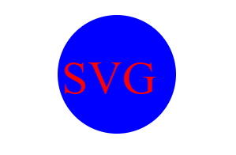
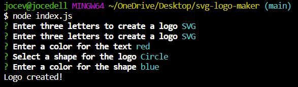

# svg-logo-maker

## Description
This project was to build a Node.js command-line application that generates logo shapes with three letters and save it as an SVG file. It prompts the user to select a color and shape, as well as provide color of the text for the logo.

## Screenshot

## Walkthrough Video
https://github.com/jovaldez98/svg-logo-maker/assets/125123860/e17c19cd-47ca-481e-9707-d573a415224b
## Installation
- Jest
- Inquirer
- SVG
- Shapes
- fs

## Tests
Used commands "npm test" and "node index.js" to make sure there were no errors.
